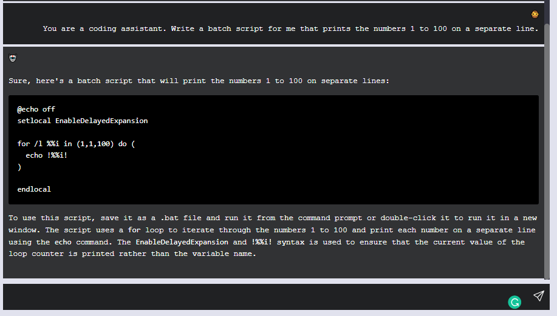

## ChatGPT
The repository contains the barebones single chat client application that mimics the similar behavior as ChatGPT. The inteface consists of an input bar at the bottom of the page. The user can type out their message and press enter/click send to receive a response. The responses are rendered via ReactMarkdown to render the code blocks and tables appropriately. The benefit of this app is you are able to access ChatGPT for a fraction of the cost. 
Here is a screenshot of the MVP:
<!-- Add Image from assets/ -->


### Installation
To run the application, follow the steps as follows: 
1. Clone the repository: 
    ```bash
      git clone https://github.com/mathadoor/ChatGPTClient.git
    ```
2. Install Node.js from this [link](https://nodejs.org/en/download/)
3. Install the dependencies with 
    ```bash
      npm install
    ```
4. Get an OpenAI API key from this [link](https://platform.openai.com/account/api-keys).
5. Create a file named .env in your root directory and add your API key as: API_KEY=```API-KEY```. Replace ```API-KEY``` with your API key.
6. Run the application as npm run dev from your root directory. 

### Customizing the response
You may customize the response by specifying your parameters in the file src\api_settings.js. To learn more about how these settings affect the output, visit [OpenAI API documentation](https://platform.openai.com/docs/api-reference/chat/create)

### Project Planning
Here I have documented the tasks I performed to realize this project. If you would like to contribute, feel free to create an issue based on the pending enhancements and start a pull request. 
#### Tasks
- [x] Completed:
  - [x] Create the React App
  - [x] Create the Chat Window
  - [x] Create the input bar
  - [x] Add new containers upon pressing enter and pressing the send button
  - [x] Route the request to ChatGPT API
  - [x] Improved styling and fixed maximum width of the window
  - [x] Freeze the send button by replacing it with a spinning wheel. 
  - [x] Highlight Sendbutton when hovering over

- [ ] Pending Enhancements
  - [ ] Clean up the styling and make it more consistent and generalized
  - [ ] Add the option to regenerate response
  - [ ] Stream and animate the text
  - [ ] Collapsible Sidebar to set the other parameters such as temperature, top_p, etc.

