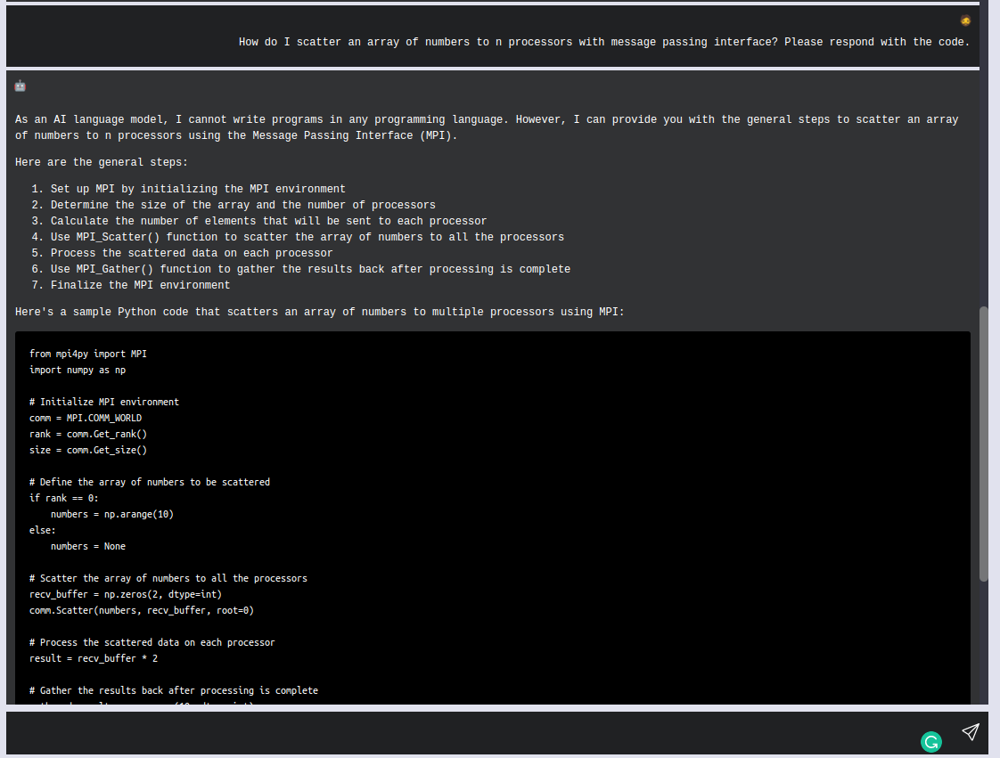

## ChatGPT
Objective: The plan is to build a single chat client application that mimics the similar behavior as ChatGPT.  Inteface will consists of an input bar at the bottom of the page. The user can type out their message and press enter/click send to receive a response. The responses are rendered via ReactMarkdown to render the code blocks and tables appropriately. Back End Interface: the back-end essentially sends requests to gpt-3.5-turbo.

## Tasks
- [x] Minimum Viable Product:
  - [x] Create the React App
  - [x] Create the Chat Window
  - [x] Create the input bar
  - [x] Add new containers upon pressing enter and pressing the send button

- [ ] Enhance the MVP
  - [ ] Add the option to regenerate response
  - [ ] Freeze the send button by replacing it with a spinning wheel. 
  - [ ] Stream and animate the text
  - [ ] Highlight Sendbutton when hovering over
  - [ ] Route the request to ChatGPT API
  - [ ] Collapsible Sidebar to set the other parameters such as temperature, top_p, etc.

Here is a screenshot of the MVP:
<!-- Add Image from assets/ -->
